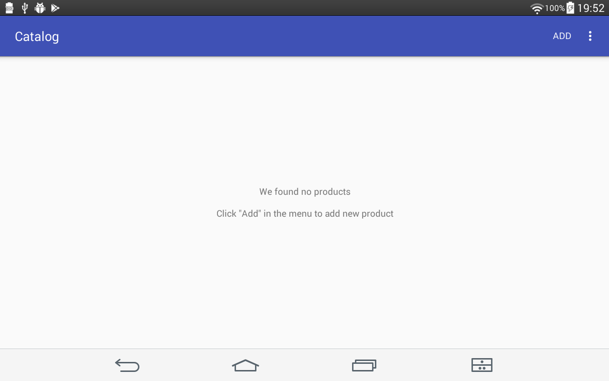

# Inventory App

Eighth task from Udacity's [Android basics course](https://www.udacity.com/course/android-basics-nanodegree-by-google--nd803)

Android Basics: Data Storage

[Lesson 5: Inventory App](https://review.udacity.com/#!/rubrics/163/view)

The app contains a list of current products and a menu item to add a new product.

Each list item displays the product name, current quantity, and price. 

Each list item also contains a Sale Button that reduces the quantity by one (no negative quantities are displayed).

The Detail Layout for each item displays the remainder of the information stored in the database.

The Detail Layout contains:
- buttons that increase and decrease the available quantity displayed.
- a button to order from the supplier.
- a button to delete the product record entirely.

When there is no information to display in the database, the layout displays a TextView with instructions on how to populate the database.

When user inputs product information (quantity, price, name), the app includes logic to validate that no null values are accepted. If a null value is inputted, app shows a Toast that prompts the user to input the correct information before they can continue.

The listView populates with the current products stored in the table.

The Add product button prompts the user for information about the product, each of which are then properly stored in the table.

The ‘order more’ button sends an intent to a phone app to contact the supplier using the information stored in the database.

The delete button prompts the user for confirmation and, if confirmed, deletes the product record entirely and sends the user back to the main activity.

In the next commit I'll add feature for adding and storing images.